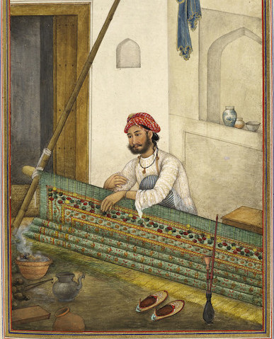

# Welcome {-}

This website serves as the course manual and syllabus for HIST3814, Summer 2017 at Carleton University. Non Carleton students are welcome to enrol via [eCampusOntario](http://ecampusontario.org), whose funding support for the development of this course is gratefully acknowledged.

The online version of this book is licensed under the [Creative Commons Attribution-NonCommercial-ShareAlike 4.0 International License](http://creativecommons.org/licenses/by-nc-sa/4.0/).
